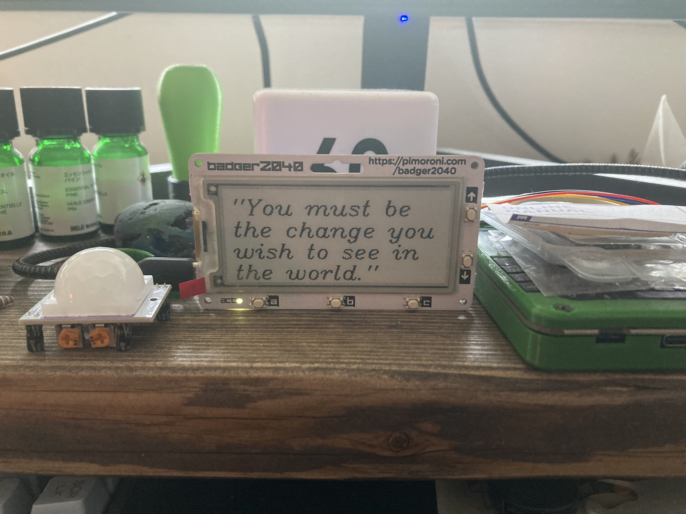

# Badger2040 Quoteboard

Use a badger2040 as a quoteboard!

### Features:
* Tries to layout the quote at the largest size possible given the length of text
* Driven by "quotes.txt" file (upload alongside `badger_quoteboard.py`)
* Use the up/down buttons to cycle linearly through the shuffled quotes
* use the a/b/c button to shuffle to a random quote
* Configurable "cooldown" for how long a quote can't be changed for (visualized by LED)
